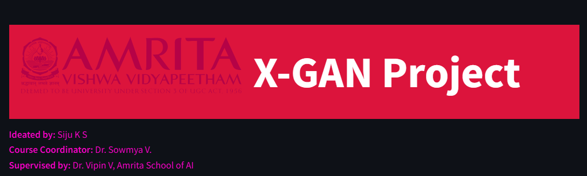
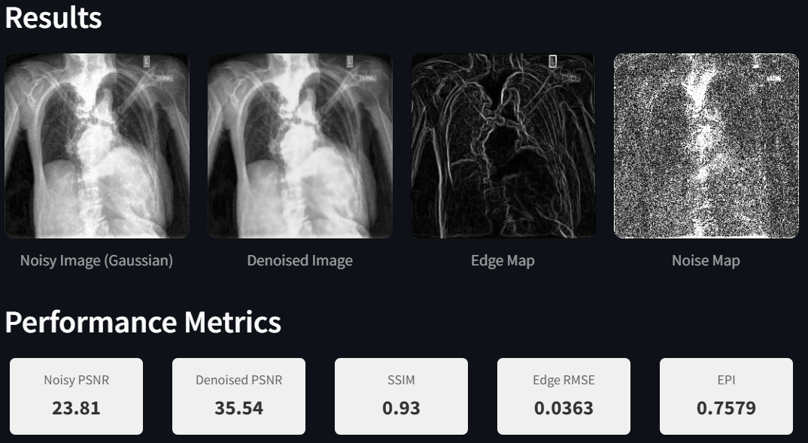

## Project repository for X-GAN

This repository contains the complete code, results and models from the X-GAN project. This project is done by Mr. Siju K. S, Research Scholar, Amrita School of Artificial Intelligence and is supervised by [Dr. Vipin Venugopal](https://sites.google.com/view/vipin-venugopal?pli=1) , Assistant Professor (Sel.Gr), Amrita School of Artificial Intelligence, Amrita Vishwa Vidyapeetham, Coimbatore.


## X-GAN Project Documentation


## Project Overview

This project implements a **Generative Adversarial Network (GAN)** for medical image denoising. The model, named **X-GAN**, leverages advanced techniques such as **Spectral Normalization**, **Edge Preservation Index (EPI)**, and **Custom Sobel Edge Layers** to produce high-quality denoised images while preserving critical structural details. The architecture consists of:

- A **U-Net-like generator** for denoising.
- A **PatchGAN discriminator** for adversarial training.
- Custom loss functions combining **adversarial loss**, **reconstruction loss**, and **gradient penalty**.

The project is designed to handle realistic noise models in medical imaging datasets and provides tools for evaluation metrics such as **PSNR**, **SSIM**, and **Edge RMSE**.
A detaild discussion of the novelty of this work with proper justifications is available at [Novelty](https://github.com/sijuswamyresearch/X-GAN/blob/main/X-GAN%20Novelty.md).
---

## Installation Instructions

### Prerequisites
- Python 3.8 or higher
- TensorFlow 2.x
- Dependencies: `numpy`, `scikit-image`, `matplotlib`, `opencv-python`, `tqdm`

----

## 📁 Repository Structure

```
medical_image_denoising/
│
├── configs/
│   └── default.yaml       # Hyperparameters and paths
│
├── data/
│   ├── __init__.py
│   ├── dataloader.py      # Data loading and preprocessing
│   └── augmentations.py   # Noise addition and transforms
│
├── models/
│   ├── __init__.py
│   ├── generator.py       # Generator architecture
│   ├── discriminator.py   # Discriminator architecture
│   ├── xgan.py           # Main GAN system
│   └── layers.py         # Custom layers
│
├── training/
│   ├── __init__.py
│   ├── trainer.py        # Training loop
│   ├── losses.py         # Loss functions
│   └── callbacks.py      # Custom callbacks
│
├── utils/
│   ├── __init__.py
│   ├── metrics.py        # EPI, PSNR, SSIM calculations
│   ├── visualize.py      # Plotting functions
│   └── logger.py         # Logging setup
│
├── scripts/
│   ├── train.py          # Training script
│   └── evaluate.py       # Evaluation script
│
└── main.py               # Entry point
```

----

### Steps to Install
1. Clone the repository:
   ```bash
   git clone https://github.com/sijuswamyresearch/X-GAN.git
   cd medical_image_denoising
   ```
2. Create a virtual environment (optional but recommended):
   ```bash
    python -m venv venv
    source venv/bin/activate  # On Windows: venv\Scripts\activate
   ```
3. Install dependencies:

   ```bash
   pip install -r requirements.txt
   ```
4. Download and preprocess your dataset:

   - Place your medical images in the `data/ directory`.
   - Update paths in `configs/default.yaml`.
5. Verify installation:
  Run the following command to ensure everything is set up correctly:
   ```bash
   python main.py --help
   ```
6. Usage Instructions

- Training the Model
  Update configuration file (`configs/default.yaml`) with your dataset paths and hyperparameters.
  Run the training script:
  ```bash
   python scripts/train.py --config configs/default.yaml
  ```
7. Monitor training progress using TensorBoard:

   ```bash
   tensorboard --logdir logs/
   ```
8. Evaluating the Model

   1. Evaluate the trained model on test data:
      ```bash
      python scripts/evaluate.py --config configs/default.yaml --weights path/to/best_model.h5
      ```
   2. Visualize results:

      - Metrics (PSNR, SSIM, EPI) will be logged in the console.
      - Plots of original, noisy, and denoised images will be saved in the results/ directory.

9. Running k-Fold Cross-Validation
 To perform k-fold cross-validation:

  ```bash
  python scripts/train.py --config configs/default.yaml --k_folds 5
  ```


----

### Citation

If you use this project in your research, please cite it as follows:

```bash
@misc{X-GAN2025,
  author = {K S Siju, V Vipin, V Sowmya},
  title  = {X-GAN: A Domain Specific Deep Learning Method for Chest X-ray denoising},
  year   = {2025},
  publisher = {GitHub},
  journal = {GitHub Repository},
  url    = {https://github.com/sijuswamyresearch/X-GAN}
}
```
